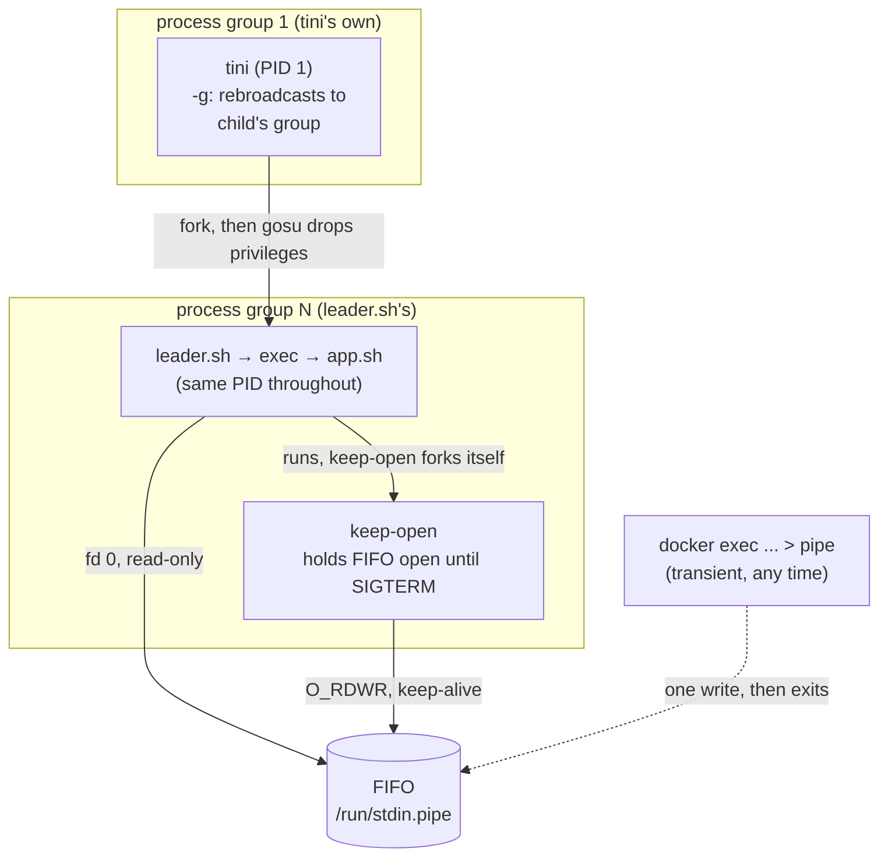
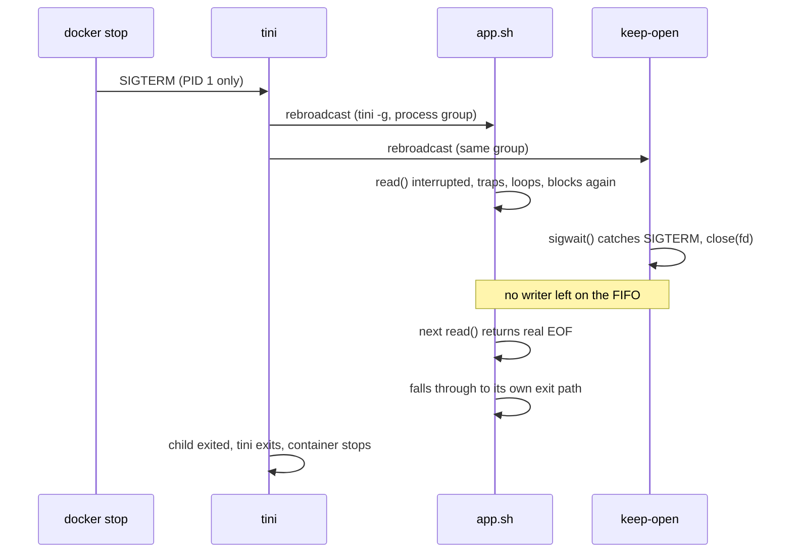

# swerve

Template for containerizing an application that needs a durable,
scriptable stdin channel and a root-to-unprivileged-user handoff.

## Problem

Docker's native stdin (`-i` / `OpenStdin`) has real limits:

- Decided at container creation, no way to add it later. Without
  `-i`, fd 0 is `/dev/null` for the container's whole life (no
  `docker update` path to change it after the fact).
- Even with `-i`, it's specifically `/proc/1/fd/0`. `fork`/`exec`
  preserve fds by default, so an init chain that drops privileges
  (`tini` → `gosu` → the app) can still reach it, _if_ nothing along
  the way ever replaces fd 0. That's an implicit contract every
  future change to the chain has to keep honoring.

This project instead routes stdin from a FIFO on disk to `app.sh`,
in `leader.sh` right before its final exec: addressed by path, not
by which process holds which fd, and independent of `-i` entirely.
Any number of `docker exec` calls, at any time, can write to it.

## Features

- **Durable stdin via FIFO**: write to the running container at any
  time with `docker exec <container> sh -c '... > /run/stdin.pipe'`.
  No `-i`, no attach session to keep alive.
- **Privilege drop**: `entrypoint.sh` runs as root only long enough
  to create the FIFO and `chown` it, then hands off to the app user
  via [`gosu`](https://github.com/tianon/gosu). The app never runs
  as root.
- **Correct PID 1 semantics**: [`tini`](https://github.com/krallin/tini)
  reaps zombies and forwards signals, so the app doesn't have to
  reimplement init behavior to be a container's entrypoint.
- **Real graceful shutdown**: `SIGTERM` causes the app's normal
  `read` loop to see an actual EOF and exit through its own code
  path, not a forced kill. See [Shutdown](#shutdown) below for why
  that's harder than it sounds.
- **Locked-down runtime**: the test (`test.sh`) drops all
  capabilities and adds back only `SETUID`, `SETGID`, `CHOWN`, `KILL`
  (what the privilege drop and signal delivery actually need), plus
  `--security-opt=no-new-privileges`.

## Architecture



`entrypoint.sh` (root) never opens the FIFO itself: see
`keep-open.c` for why. `leader.sh` and `keep-open` open it fresh
instead, after privileges are already dropped.

## Shutdown

The subtle part: getting `app.sh`'s ordinary `read` loop to exit via
a genuine end-of-stream, rather than being killed out from under it.



This needs a process _other than_ `app.sh` to hold the FIFO's write
side, without `app.sh` ever knowing it exists. `keep-open` is a C
binary rather than a shell script: see `keep-open.c` for why a
shell trap wasn't reliable here.

## Files

| File                   | Role                                               |
| ---------------------- | -------------------------------------------------- |
| `docker/Dockerfile`    | Multi-stage: compiles `keep-open`, assembles image |
| `docker/entrypoint.sh` | Creates the FIFO, `chown`s it, execs `tini`        |
| `docker/leader.sh`     | Process leader: launches `keep-open`, execs app    |
| `docker/keep-open.c`   | Holds the FIFO open until `SIGTERM`; app-agnostic  |
| `docker/app.sh`        | The app to replace with your own (see below)       |
| `script/test.sh`       | End-to-end test: build, run, assert invariants     |
| `script/lint.sh`       | Static checks: shell syntax, signal agreement      |
| `Makefile`             | `make help` \| `image` \| `lint` \| `test` \| `sh` |

## Using this as a template

1. Replace `docker/app.sh` with your own program. It only needs to
   read stdin normally: no FIFO, signal, or privilege-drop code of
   its own.
2. Update the `Dockerfile`'s `COPY` line(s) and any runtime deps your
   app needs.
3. Everything else (`entrypoint.sh`, `leader.sh`, `keep-open.c`)
   is app-agnostic and shouldn't need to change.

## Quickstart

```sh
make lint         # static checks, no extra tools
make test         # build, run, assert invariants, tee output to test.log
make shell        # drop into a shell in the built image
docker exec <container> sh -c 'echo hello > /run/stdin.pipe'
```
