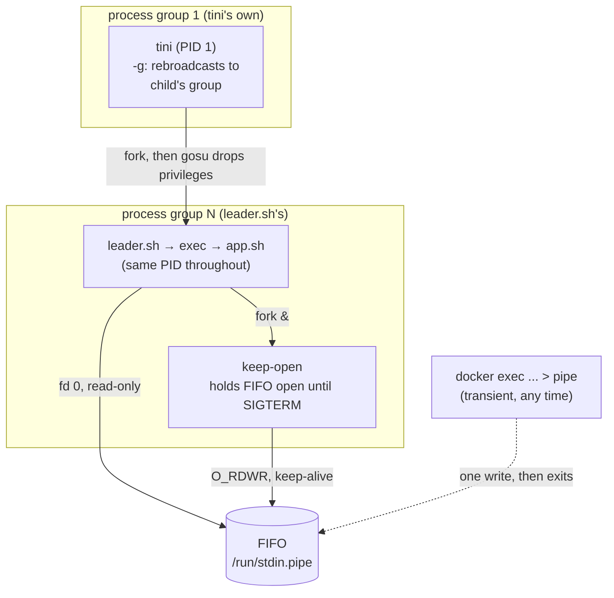
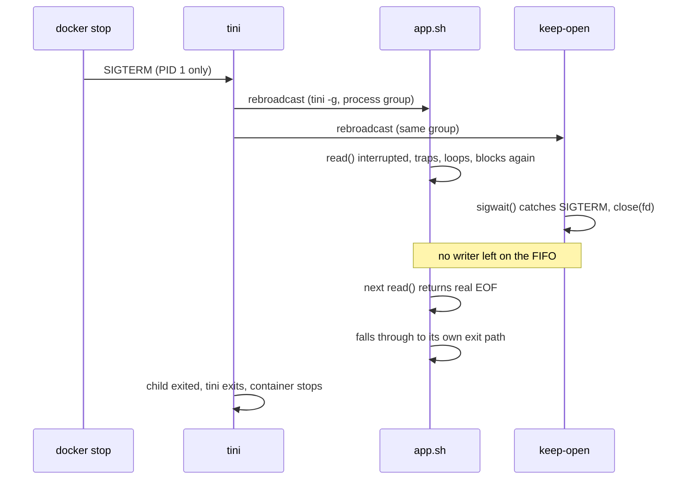

# swerve

Template for containerizing an application that needs a durable,
scriptable stdin channel and a root-to-unprivileged-user handoff.

## Problem

Docker's native stdin (`-i` / `OpenStdin`) has one hard limitation:
it's decided at container creation and can't be turned on later.
Without `-i`, fd 0 is `/dev/null` for the container's whole life
(confirmed via `docker inspect`), with no `docker update` path to
change it after the fact.

With `-i`, it's an open pipe from the start, and
`docker exec ... > /proc/1/fd/0` writes to it fine with no `docker
attach` client ever needed. `fork`/`exec` preserve fds by default, so
that pipe reaches the actual app even through an init chain that
drops privileges like this one's (`tini` → `gosu` → the app), *as
long as* nothing along the way ever replaces fd 0 (verified: with
`leader.sh` changed to skip that step, the app received a write via
`/proc/1/fd/0` with no attach session at all). That's the catch: it's
an implicit contract every link in the chain has to honor forever, on
top of still needing `-i` decided upfront.

This project instead routes stdin from a FIFO on disk to `app.sh`,
in `leader.sh` right before its final exec into the app: the FIFO
exists independent of how the container was started, and it's
addressed by path, not by which process happens to hold which fd.
Any number of `docker exec` calls, at any time, can write to it. The
app never knows the difference: it reads fd 0 like any other
program.

## Features

- **Durable stdin via FIFO**: write to the running container at any
  time with `docker exec <container> sh -c '... > /run/stdin.pipe'`.
  No `-i`, no attach session to keep alive.
- **Privilege drop**: `entrypoint.sh` runs as root only long enough
  to create the FIFO and `chown` it, then hands off to the app user
  via [`gosu`](https://github.com/tianon/gosu). The app never runs
  as root.
- **Correct PID 1 semantics**: [`tini`](https://github.com/krallin/tini)
  reaps zombies and forwards signals, so the app doesn't have to
  reimplement init behavior to be a container's entrypoint.
- **Real graceful shutdown**: `SIGTERM` causes the app's normal
  `read` loop to see an actual EOF and exit through its own code
  path, not a forced kill. See [Shutdown](#shutdown) below for why
  that's harder than it sounds.
- **Locked-down runtime**: the demo (`run.sh`) drops all
  capabilities and adds back only `SETUID`, `SETGID`, `CHOWN`, `KILL`
  (what the privilege drop and signal delivery actually need), plus
  `--security-opt=no-new-privileges`.

## Architecture



`entrypoint.sh` (root) never opens the FIFO itself: whatever it
opened would be inherited by `tini` and held open for the
container's entire lifetime, permanently blocking a real EOF no
matter what closed downstream. `leader.sh` and `keep-open` open it
fresh instead, after privileges are already dropped.

## Shutdown

The subtle part: getting `app.sh`'s ordinary `read` loop to exit via
a genuine end-of-stream, rather than being killed out from under it.



This needs a process *other than* `app.sh` to hold the FIFO's write
side and release it on command, without `app.sh` ever knowing that
process exists. `keep-open` is a small static C binary, not a shell
script, because of it: a shell trap that closed an fd after
interrupting a blocking `wait` did not reliably surface as EOF to a
reader elsewhere in testing, even though the close itself took
effect. `sigwait` in C has no such race.

## Files

| File | Role |
| --- | --- |
| `docker/Dockerfile` | Multi-stage build: compiles `keep-open`, assembles the runtime image |
| `docker/entrypoint.sh` | Root setup: creates the FIFO, `chown`s it, execs `tini` |
| `docker/leader.sh` | tini's child and process-group leader. Launches `keep-open`, then execs into the app |
| `docker/keep-open.c` | Holds the FIFO open until `SIGTERM`. Knows nothing about `app.sh` (app-agnostic by design) |
| `docker/app.sh` | The application to replace with your own (see below) |
| `run.sh` | End-to-end demo: builds, feeds input, sends signals, shows a graceful exit |
| `Makefile` | `make help` \| `image` \| `run` \| `shell`/`sh` |

## Using this as a template

1. Replace `docker/app.sh` with your own program. It only needs to
   read stdin normally: no FIFO, signal, or privilege-drop code of
   its own.
2. Update the `Dockerfile`'s `COPY` line(s) and any runtime deps your
   app needs.
3. Everything else (`entrypoint.sh`, `leader.sh`, `keep-open.c`)
   is app-agnostic and shouldn't need to change.

## Quickstart

```sh
make run          # build, run the demo end-to-end, tee output to run.log
make shell        # drop into a shell in the built image
docker exec <container> sh -c 'echo hello > /run/stdin.pipe'
```
